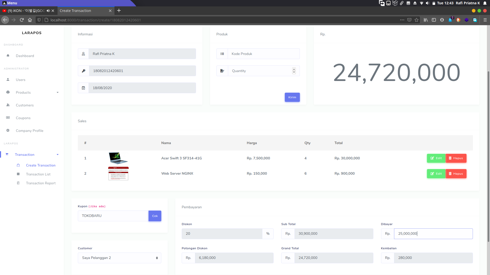

# UAS ANDES NIKEN LARASATI
[](https://packagist.org/packages/laravel/framework)

## About
Aplikasi pencatatan penjualan toko sederhana dibuat dengan Laravel 7.
Hi everybody!!
I'm trying to learn programming and I want to become a realible Data Analyst. This is my first step to get started. I hope this will be a good fisrt step for me in the future.
This is also to fulfill the final assignment for the Design and Systmes Analysis course.

### Screenshot


## Installasi
```
git clone https://github.com/rafipriatna/LaraPos
cd LaraPos
composer install
```
Buat database baru, lalu rename `.env.example` menjadi `.env`, lalu edit:
```
DB_CONNECTION=mysql
DB_HOST=127.0.0.1
DB_PORT=3306
DB_DATABASE=laravel
DB_USERNAME=root
DB_PASSWORD=
```
Edit sesuai dengan informasi database yang sudah dibuat.
Setelah itu, lakukan migrasi.
```
php artisan migrate
```
Silakan lakukan register akun di `http://localhost:8000/register`. Secara bawaan, rolenya adalah 'user', untuk mengubahnya
menjadi admin, maka perlu edit manual di table users.

## Lisensi
[MIT license](https://opensource.org/licenses/MIT)
